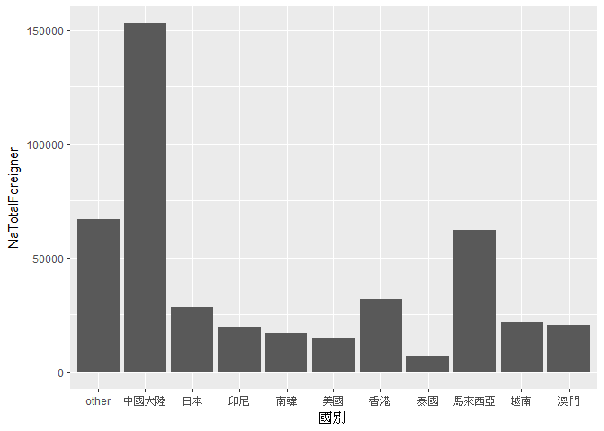
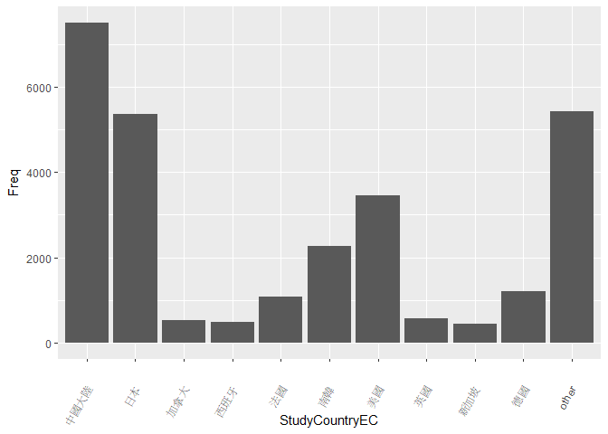

106-2 大數據分析方法 作業二
================
洪芝盈b0444227

作業完整說明[連結](https://docs.google.com/document/d/1aLGSsGXhgOVgwzSg9JdaNz2qGPQJSoupDAQownkGf_I/edit?usp=sharing)

學習再也不限定在自己出生的國家，台灣每年有許多學生選擇就讀國外的大專院校，同時也有人多國外的學生來台灣就讀，透過分析[大專校院境外學生人數統計](https://data.gov.tw/dataset/6289)、[大專校院本國學生出國進修交流數](https://data.gov.tw/dataset/24730)、[世界各主要國家之我國留學生人數統計表](https://ws.moe.edu.tw/Download.ashx?u=C099358C81D4876CC7586B178A6BD6D5062C39FB76BDE7EC7685C1A3C0846BCDD2B4F4C2FE907C3E7E96F97D24487065577A728C59D4D9A4ECDFF432EA5A114C8B01E4AFECC637696DE4DAECA03BB417&n=4E402A02CE6F0B6C1B3C7E89FDA1FAD0B5DDFA6F3DA74E2DA06AE927F09433CFBC07A1910C169A1845D8EB78BD7D60D7414F74617F2A6B71DC86D17C9DA3781394EF5794EEA7363C&icon=..csv)可以了解103年以後各大專院校國際交流的情形。請同學分析以下議題，並以視覺化的方式呈現分析結果，呈現103年以後大專院校國際交流的情形。

來台境外生分析
--------------

### 資料匯入與處理

##### 1. 載入所有會用到的套件

##### 2. 將"大專校院境外學生人數統計表"103年以後資料分別匯入，匯入完成後將此三個資料彙整到同一檔案中

``` r
library(dplyr)
```

    ## 
    ## Attaching package: 'dplyr'

    ## The following objects are masked from 'package:stats':
    ## 
    ##     filter, lag

    ## The following objects are masked from 'package:base':
    ## 
    ##     intersect, setdiff, setequal, union

``` r
library(readr)
```

    ## Warning: package 'readr' was built under R version 3.4.4

``` r
library(ggplot2)
```

    ## Warning: package 'ggplot2' was built under R version 3.4.4

``` r
library(plotly)
```

    ## Warning: package 'plotly' was built under R version 3.4.4

    ## 
    ## Attaching package: 'plotly'

    ## The following object is masked from 'package:ggplot2':
    ## 
    ##     last_plot

    ## The following object is masked from 'package:stats':
    ## 
    ##     filter

    ## The following object is masked from 'package:graphics':
    ## 
    ##     layout

``` r
library(choroplethr)
```

    ## Warning: package 'choroplethr' was built under R version 3.4.4

    ## Loading required package: acs

    ## Warning: package 'acs' was built under R version 3.4.4

    ## Loading required package: stringr

    ## Warning: package 'stringr' was built under R version 3.4.4

    ## Loading required package: XML

    ## 
    ## Attaching package: 'acs'

    ## The following object is masked from 'package:dplyr':
    ## 
    ##     combine

    ## The following object is masked from 'package:base':
    ## 
    ##     apply

``` r
library(rworldmap)
```

    ## Warning: package 'rworldmap' was built under R version 3.4.4

    ## Loading required package: sp

    ## Warning: package 'sp' was built under R version 3.4.4

    ## ### Welcome to rworldmap ###

    ## For a short introduction type :   vignette('rworldmap')

``` r
library(RColorBrewer)
nation103<-read_csv("https://quality.data.gov.tw/dq_download_csv.php?nid=6289&md5_url=25f64d5125016dcd6aed42e50c972ed0")
```

    ## Parsed with column specification:
    ## cols(
    ##   洲別 = col_character(),
    ##   國別 = col_character(),
    ##   `學位生-正式修讀學位外國生` = col_integer(),
    ##   `學位生-僑生(含港澳)` = col_integer(),
    ##   `學位生-正式修讀學位陸生` = col_integer(),
    ##   `非學位生-外國交換生` = col_integer(),
    ##   `非學位生-外國短期研習及個人選讀` = col_integer(),
    ##   `非學位生-大專附設華語文中心學生` = col_integer(),
    ##   `非學位生-大陸研修生` = col_integer(),
    ##   `非學位生-海青班` = col_integer(),
    ##   境外專班 = col_integer()
    ## )

``` r
nation104<-read_csv("https://quality.data.gov.tw/dq_download_csv.php?nid=6289&md5_url=4d3e9b37b7b0fd3aa18a388cdbc77996")
```

    ## Parsed with column specification:
    ## cols(
    ##   洲別 = col_character(),
    ##   國別 = col_character(),
    ##   `學位生-正式修讀學位外國生` = col_integer(),
    ##   `學位生-僑生(含港澳)` = col_integer(),
    ##   `學位生-正式修讀學位陸生` = col_integer(),
    ##   `非學位生-外國交換生` = col_integer(),
    ##   `非學位生-外國短期研習及個人選讀` = col_integer(),
    ##   `非學位生-大專附設華語文中心學生` = col_integer(),
    ##   `非學位生-大陸研修生` = col_integer(),
    ##   `非學位生-海青班` = col_integer(),
    ##   境外專班 = col_integer()
    ## )

``` r
nation105<-read_csv("https://quality.data.gov.tw/dq_download_csv.php?nid=6289&md5_url=19bedf88cf46999da12513de755c33c6")
```

    ## Parsed with column specification:
    ## cols(
    ##   洲別 = col_character(),
    ##   國別 = col_character(),
    ##   學位生_正式修讀學位外國生 = col_integer(),
    ##   `學位生_僑生(含港澳)` = col_integer(),
    ##   學位生_正式修讀學位陸生 = col_integer(),
    ##   非學位生_外國交換生 = col_integer(),
    ##   非學位生_外國短期研習及個人選讀 = col_integer(),
    ##   非學位生_大專附設華語文中心學生 = col_integer(),
    ##   非學位生_大陸研修生 = col_integer(),
    ##   非學位生_海青班 = col_integer(),
    ##   境外專班 = col_integer()
    ## )

``` r
nation106<-read_csv("https://quality.data.gov.tw/dq_download_csv.php?nid=6289&md5_url=50e3370f9f8794f2054c0c82a2ed8c91")
```

    ## Parsed with column specification:
    ## cols(
    ##   洲別 = col_character(),
    ##   國別 = col_character(),
    ##   學位生_正式修讀學位外國生 = col_integer(),
    ##   `學位生_僑生(含港澳)` = col_integer(),
    ##   學位生_正式修讀學位陸生 = col_integer(),
    ##   非學位生_外國交換生 = col_integer(),
    ##   非學位生_外國短期研習及個人選讀 = col_integer(),
    ##   非學位生_大專附設華語文中心學生 = col_integer(),
    ##   非學位生_大陸研修生 = col_integer(),
    ##   非學位生_海青班 = col_integer(),
    ##   境外專班 = col_integer()
    ## )

``` r
nation104105<-inner_join(nation104,nation105,by=c("洲別","國別"))
nation105106<-inner_join(nation104105,nation106,by=c("洲別","國別"))
nationTotal<-inner_join(nation105106,nation103,by=c("洲別","國別"))

college103<-read_csv("https://quality.data.gov.tw/dq_download_csv.php?nid=6289&md5_url=a6d1469f39fe41fb81dbfc373aef3331")
```

    ## Parsed with column specification:
    ## cols(
    ##   學校類型 = col_character(),
    ##   學校代碼 = col_character(),
    ##   學校名稱 = col_character(),
    ##   `學位生-正式修讀學位外國生` = col_integer(),
    ##   `學位生-僑生(含港澳)` = col_integer(),
    ##   `學位生-正式修讀學位陸生` = col_integer(),
    ##   `非學位生-外國交換生` = col_integer(),
    ##   `非學位生-外國短期研習及個人選讀` = col_integer(),
    ##   `非學位生-大專附設華語文中心學生` = col_integer(),
    ##   `非學位生-大陸研修生` = col_character(),
    ##   `非學位生-海青班` = col_integer(),
    ##   境外專班 = col_integer()
    ## )

``` r
college104<-read_csv("https://quality.data.gov.tw/dq_download_csv.php?nid=6289&md5_url=8baeae81cba74f35cf0bb1333d3d99f5")
```

    ## Parsed with column specification:
    ## cols(
    ##   學校類型 = col_character(),
    ##   學校代碼 = col_character(),
    ##   學校名稱 = col_character(),
    ##   `學位生-正式修讀學位外國生` = col_integer(),
    ##   `學位生-僑生(含港澳)` = col_integer(),
    ##   `學位生-正式修讀學位陸生` = col_integer(),
    ##   `非學位生-外國交換生` = col_integer(),
    ##   `非學位生-外國短期研習及個人選讀` = col_integer(),
    ##   `非學位生-大專附設華語文中心學生` = col_integer(),
    ##   `非學位生-大陸研修生` = col_character(),
    ##   `非學位生-海青班` = col_integer(),
    ##   境外專班 = col_integer()
    ## )

``` r
college105<-read_csv("https://quality.data.gov.tw/dq_download_csv.php?nid=6289&md5_url=1a485383cf9995da679c3798ab4fd681")
```

    ## Parsed with column specification:
    ## cols(
    ##   學校類型 = col_character(),
    ##   學校代碼 = col_character(),
    ##   學校名稱 = col_character(),
    ##   學位生_正式修讀學位外國生 = col_integer(),
    ##   `學位生_僑生(含港澳)` = col_integer(),
    ##   學位生_正式修讀學位陸生 = col_integer(),
    ##   非學位生_外國交換生 = col_integer(),
    ##   非學位生_外國短期研習及個人選讀 = col_integer(),
    ##   非學位生_大專附設華語文中心學生 = col_integer(),
    ##   非學位生_大陸研修生 = col_integer(),
    ##   非學位生_海青班 = col_integer(),
    ##   境外專班 = col_integer()
    ## )

``` r
college106<-read_csv("https://quality.data.gov.tw/dq_download_csv.php?nid=6289&md5_url=883e2ab4d5357f70bea9ac44a47d05cc")
```

    ## Parsed with column specification:
    ## cols(
    ##   學校類型 = col_character(),
    ##   學校代碼 = col_character(),
    ##   學校名稱 = col_character(),
    ##   學位生_正式修讀學位外國生 = col_integer(),
    ##   `學位生_僑生(含港澳)` = col_integer(),
    ##   學位生_正式修讀學位陸生 = col_integer(),
    ##   非學位生_外國交換生 = col_integer(),
    ##   非學位生_外國短期研習及個人選讀 = col_integer(),
    ##   非學位生_大專附設華語文中心學生 = col_integer(),
    ##   非學位生_大陸研修生 = col_integer(),
    ##   非學位生_海青班 = col_integer(),
    ##   境外專班 = col_integer()
    ## )

``` r
college104$"非學位生-大陸研修生"<-as.numeric(gsub("…","NA",college104$"非學位生-大陸研修生"))
```

    ## Warning: 強制變更過程中產生了 NA

``` r
college103$"非學位生-大陸研修生"<-as.numeric(gsub("…","NA",college103$"非學位生-大陸研修生"))
```

    ## Warning: 強制變更過程中產生了 NA

``` r
college104105<-inner_join(college104,college105,by=c("學校類型","學校代碼", "學校名稱"))
college105106<-inner_join(college104105,college106,by=c("學校類型","學校代碼", "學校名稱"))
collegeTotal<-inner_join(college105106,college103,by=c("學校類型","學校代碼", "學校名稱"))
```

### 哪些國家來台灣唸書的學生最多呢？

##### 1. 利用rowSums()，將每一國家來台灣念書的所有學生加總，得出某一國家總共來台的學生數量，並當成一個欄位新增至nationTotal資料表中

##### 2. 由大到小排序各國家學生總共來台的數量，取出人數最多的前十名

``` r
nationTotal$NaTotalForeigner<- rowSums(nationTotal[, c(-1 ,-2 )], na.rm = TRUE)
nationTopTen<-nationTotal$`國別`[head(order(nationTotal$NaTotalForeigner,decreasing = T),10)]
nationTopTen
```

    ##  [1] "中國大陸" "馬來西亞" "香港"     "日本"     "越南"     "澳門"    
    ##  [7] "印尼"     "南韓"     "美國"     "泰國"

``` r
TotalNumTopTen<-nationTotal$NaTotalForeigner[head(order(nationTotal$NaTotalForeigner,decreasing = T),10)]
TotalNumTopTen
```

    ##  [1] 152524  62031  31940  28200  21670  20302  19620  16948  14846   7035

``` r
nationTotalT<-data.frame(nationTopTen=nationTopTen,naTotalNumTopTen=TotalNumTopTen)
library(knitr)
```

    ## Warning: package 'knitr' was built under R version 3.4.4

``` r
kable(head(nationTotalT,10))
```

| nationTopTen |  naTotalNumTopTen|
|:-------------|-----------------:|
| 中國大陸     |            152524|
| 馬來西亞     |             62031|
| 香港         |             31940|
| 日本         |             28200|
| 越南         |             21670|
| 澳門         |             20302|
| 印尼         |             19620|
| 南韓         |             16948|
| 美國         |             14846|
| 泰國         |              7035|

### 哪間大學的境外生最多呢？

##### 1. 利用rowSums()，將每一大學的境外生加總，得出某一大學總共來台的境外生數量，並當成一個欄位新增至collegeTotal資料表中

##### 2. 由大到小排序各大學的境外生總共來台數量，取出人數最多的前十名

``` r
collegeTotal$coTotalForeigner<- rowSums(collegeTotal[, c(-1 ,-2, -3 )], na.rm = TRUE)
collegeTopTen<-collegeTotal$`學校名稱`[head(order(collegeTotal$coTotalForeigner,decreasing = T),10)]
collegeTopTen
```

    ##  [1] "國立臺灣師範大學" "國立臺灣大學"     "中國文化大學"    
    ##  [4] "銘傳大學"         "淡江大學"         "國立政治大學"    
    ##  [7] "國立成功大學"     "輔仁大學"         "逢甲大學"        
    ## [10] "中原大學"

``` r
cTotalNumTopTen<-collegeTotal$coTotalForeigner[head(order(collegeTotal$coTotalForeigner,decreasing = T),10)]
cTotalNumTopTen
```

    ##  [1] 22113 18199 16074 16057 13887 11626 10982  9499  9474  7662

``` r
collegeT<-data.frame(collegeTopTen=collegeTopTen,cTotalNumTopTen=cTotalNumTopTen)
library(knitr)
kable(head(collegeT,10))
```

| collegeTopTen    |  cTotalNumTopTen|
|:-----------------|----------------:|
| 國立臺灣師範大學 |            22113|
| 國立臺灣大學     |            18199|
| 中國文化大學     |            16074|
| 銘傳大學         |            16057|
| 淡江大學         |            13887|
| 國立政治大學     |            11626|
| 國立成功大學     |            10982|
| 輔仁大學         |             9499|
| 逢甲大學         |             9474|
| 中原大學         |             7662|

### 各個國家來台灣唸書的學生人數條狀圖

``` r
nationTotalTopTen<-nationTotal%>%group_by(`國別`)%>%
  summarise(NaTotalForeigner=sum(NaTotalForeigner))%>%arrange(desc(NaTotalForeigner))
```

    ## Warning: package 'bindrcpp' was built under R version 3.4.4

``` r
nationTotalTopTen<-rbind(top_n(nationTotalTopTen,10),slice(nationTotalTopTen,11:n())%>%summarise(`國別`="other",NaTotalForeigner=sum(NaTotalForeigner)))
```

    ## Selecting by NaTotalForeigner

``` r
ggplot()+geom_bar(data=nationTotalTopTen,aes(x=`國別`, y=`NaTotalForeigner`),stat = "identity")
```



### 各個國家來台灣唸書的學生人數面量圖

``` r
CountriesComparisionTable <- read_csv("C:/Users/aaa/Desktop/CountriesComparisionTable.csv")
```

    ## Parsed with column specification:
    ## cols(
    ##   ISO3 = col_character(),
    ##   English = col_character(),
    ##   Taiwan = col_character()
    ## )

``` r
CountriesComparisionTable<-rename(CountriesComparisionTable,`國別`=`Taiwan`)
nationmerge<-inner_join(CountriesComparisionTable,nationTotal,by="國別")
d <- data.frame(
  country=nationmerge$ISO3,
  value=nationmerge$NaTotalForeigner)

n <- joinCountryData2Map(d, joinCode="NAME", nameJoinColumn="country")
```

    ## 137 codes from your data successfully matched countries in the map
    ## 0 codes from your data failed to match with a country code in the map
    ## 107 codes from the map weren't represented in your data

``` r
numCats<-50
palette=colorRampPalette(brewer.pal(n=9,name='Greens'))(numCats)
MAPSHOW<-mapCountryData(n, nameColumnToPlot="value", mapTitle="World",catMethod = 'fixedWidth',numCats=numCats,colourPalette =palette,addLegend = T)
```

.png)

台灣學生國際交流分析
--------------------

### 資料匯入與處理

##### 1. 載入所有會用到的套件

##### 2. 先整理csv的資料檔案

##### 3. 再將"大專校院本國學生出國進修交流數"資料匯入r中，匯入完成後只留下103學年度以後的資料

``` r
library(dplyr)
library(readr)
library(ggplot2)
library(plotly)
library(choroplethr)
library(rworldmap)
library(RColorBrewer)

StudentgoabroadEC <- read.csv("C:/Users/aaa/Desktop/Student_RPT_07_all.csv")
StudentgoabroadEC<-filter(StudentgoabroadEC,`學年度`>102)
```

### 台灣大專院校的學生最喜歡去哪些國家進修交流呢？

##### 1. 用子集取出每個學生交流的國家後，計算各國家總次數

##### 2. 由大到小排序

``` r
StudyCountryEC<-StudentgoabroadEC$`對方學校.機構.國別.地區.`
StudyCountryCountEC<-as.data.frame(table(StudyCountryEC))
StudyCountryTopTenEC<-StudyCountryCountEC$StudyCountryEC[head(order(StudyCountryCountEC$Freq,decreasing = T),10)]
StudyCountryTopTenEC
```

    ##  [1] 中國大陸 日本     美國     南韓     德國     法國     英國    
    ##  [8] 加拿大   西班牙   新加坡  
    ## 147 Levels:  土耳其 土耳其共和國 中國大陸 丹麥 丹麥王國 ... 羅馬尼亞

``` r
StudyCountryTopTenFreqEC<-StudyCountryCountEC$Freq[head(order(StudyCountryCountEC$Freq,decreasing = T),10)]
StudyCountryTopTenFreqEC
```

    ##  [1] 7511 5371 3463 2275 1213 1082  569  522  489  441

### 哪間大學的出國交流學生數最多呢？

##### 1. 用子集取出每個出國交流的學生是就讀甚麼學校後，計算各學校總次數

##### 2. 由大到小排序

``` r
TwCollegeEC<-StudentgoabroadEC$`學校名稱`
TwCollegeCountEC<-as.data.frame(table(TwCollegeEC))
TwCollegeTopTenEC<-TwCollegeCountEC$TwCollegeEC[head(order(TwCollegeCountEC$Freq,decreasing = T),10)]
TwCollegeTopTenEC
```

    ##  [1] 國立臺灣大學 國立政治大學 淡江大學     逢甲大學     國立交通大學
    ##  [6] 元智大學     國立成功大學 東海大學     東吳大學     國立臺北大學
    ## 157 Levels:  大仁科技大學 大同大學 ... 蘭陽技術學院

``` r
TwCollegeTopTenFreqEC<-TwCollegeCountEC$Freq[head(order(TwCollegeCountEC$Freq,decreasing = T),10)]
TwCollegeTopTenFreqEC
```

    ##  [1] 1969 1767 1390  986  867  797  759  729  697  679

### 台灣大專院校的學生最喜歡去哪些國家進修交流條狀圖

``` r
StudyCountryECTopTen<-arrange(StudyCountryCountEC,desc(Freq))
StudyCountryECTopTen<-rbind(top_n(StudyCountryECTopTen,10),slice(StudyCountryECTopTen,11:n())%>%
                           summarise(StudyCountryEC="other",Freq=sum(Freq)))
```

    ## Selecting by Freq

``` r
ggplot()+geom_bar(data=StudyCountryECTopTen,aes(x=`StudyCountryEC`, y=`Freq`),stat = "identity")+
  theme(axis.text.x = element_text(angle = 60, hjust = 1,vjust = 0.5))
```



### 台灣大專院校的學生最喜歡去哪些國家進修交流面量圖

``` r
StudyCountryCountEC<-rename(StudyCountryCountEC,`國別`=`StudyCountryEC`)
Countriesmerge<-inner_join(CountriesComparisionTable,StudyCountryCountEC,by="國別")
```

    ## Warning: Column `國別` joining character vector and factor, coercing into
    ## character vector

``` r
dd <- data.frame(
  country=Countriesmerge$ISO3,
  value=Countriesmerge$Freq)

nn <- joinCountryData2Map(dd, joinCode="NAME", nameJoinColumn="country")
```

    ## 83 codes from your data successfully matched countries in the map
    ## 0 codes from your data failed to match with a country code in the map
    ## 161 codes from the map weren't represented in your data

``` r
numCats<-50
palette=colorRampPalette(brewer.pal(n=9,name='Greens'))(numCats)
mapCountryData(nn, nameColumnToPlot="value", mapTitle="World",catMethod = 'fixedWidth',numCats=numCats,colourPalette =palette,addLegend = T)
```

.png)

台灣學生出國留學分析
--------------------

### 資料匯入與處理

##### 1. 載入所有會用到的套件

##### 2. 將"世界各主要國家之我國留學生人數統計表"資料匯入

``` r
library(dplyr)
library(readr)
library(ggplot2)
library(plotly)
library(choroplethr)
library(rworldmap)
library(RColorBrewer)

X105studyabroad <- read_csv("C:/Users/aaa/Desktop/105studyabroad.csv")
```

    ## Parsed with column specification:
    ## cols(
    ##   洲別 = col_character(),
    ##   國別 = col_character(),
    ##   總人數 = col_number()
    ## )

### 台灣學生最喜歡去哪些國家留學呢？

``` r
X105studyabroadNaTopTen<-X105studyabroad$`國別`[head(order(X105studyabroad$"總人數",decreasing = T),10)]
X105studyabroadNaTopTen
```

    ##  [1] "美國"     "澳大利亞" "日本"     "加拿大"   "英國"     "德國"    
    ##  [7] "紐西蘭"   "波蘭"     "馬來西亞" "奧地利"

``` r
X105studyabroadNaTopTenFreq<-X105studyabroad$"總人數"[head(order(X105studyabroad$"總人數",decreasing = T),10)]
X105studyabroadNaTopTenFreq
```

    ##  [1] 21127 13582  8444  4827  3815  1488  1106   561   502   419

``` r
X105studyabroadT<-data.frame(X105studyabroadNaTopTen=X105studyabroadNaTopTen,X105studyabroadNaTopTenFreq=X105studyabroadNaTopTenFreq)
library(knitr)
kable(head(X105studyabroadT,10))
```

| X105studyabroadNaTopTen |  X105studyabroadNaTopTenFreq|
|:------------------------|----------------------------:|
| 美國                    |                        21127|
| 澳大利亞                |                        13582|
| 日本                    |                         8444|
| 加拿大                  |                         4827|
| 英國                    |                         3815|
| 德國                    |                         1488|
| 紐西蘭                  |                         1106|
| 波蘭                    |                          561|
| 馬來西亞                |                          502|
| 奧地利                  |                          419|

### 台灣學生最喜歡去哪些國家留學面量圖

``` r
studyabroadmerge<-inner_join(CountriesComparisionTable,X105studyabroad,by="國別")
ddd <- data.frame(
  country=studyabroadmerge$ISO3,
  value=studyabroadmerge$`總人數`)

nnn <- joinCountryData2Map(ddd, joinCode="NAME", nameJoinColumn="country")
```

    ## 29 codes from your data successfully matched countries in the map
    ## 0 codes from your data failed to match with a country code in the map
    ## 214 codes from the map weren't represented in your data

``` r
numCats<-50
palette=colorRampPalette(brewer.pal(n=9,name='Greens'))(numCats)
mapCountryData(nnn, nameColumnToPlot="value", mapTitle="World",catMethod = 'fixedWidth',numCats=numCats,colourPalette =palette,addLegend = T)
```

.png)

綜合分析
--------

請問來台讀書與離台讀書的來源國與留學國趨勢是否相同(5分)？想來台灣唸書的境外生，他們的母國也有很多台籍生嗎？請圖文並茂說明你的觀察(10分)。

##### 觀察第一題”哪些國家來台灣唸書的學生最多”和第七題”台灣學生最喜歡去哪些國家留學”的分析結果可知，來台讀書的境外生大多是來自中國大陸，而後是馬來西亞、香港、日本…等國家。然而台灣人出國留學，大多數人的第一選擇是美國，再來是澳大利亞、日本、加拿大…等國家，因此可判斷來台讀書與離台讀書的來源國與留學國趨勢並不是很相同。由下面表格比較可知，來自中國大陸、香港、澳門等國台灣境外生，他們的國家並未有任何台灣留學生，而日本和美國則有相當多的台灣留學生，至於馬來西亞、越南、南韓和泰國等國家的台灣留學生大致在200-500人左右。

``` r
TWnessNumber<-NULL
TWness<-NULL
for(i in 1:10){
  for(ii in 1:nrow(X105studyabroad)){
     if(nationTopTen[i]==X105studyabroad$`國別`[ii]){
       temp<-X105studyabroad$`總人數`[ii]
       TWnessNumber<-rbind(TWnessNumber,temp)
       break
     }
  } 
}
for(i in 1:10){
  for(ii in 1:nrow(X105studyabroad)){
    if(nationTopTen[i]==X105studyabroad$`國別`[ii]){
      temp2<-X105studyabroad$`國別`[ii]
      TWness<-rbind(TWness,temp2)
      break
    }
  } 
}
PeopleComeTW<-data.frame(`大多數來台念書的外籍生母國`=nationTopTen ,`外籍生總數`= TotalNumTopTen)
TWnessGoAbroad<-data.frame(`留學國家`=TWness[,1],`留學此國的台灣人數`=TWnessNumber[,1])
library(knitr)
kable(head(PeopleComeTW,10))
```

| 大多數來台念書的外籍生母國 | 外籍生總數 |
|:---------------------------|:----------:|
| 中國大陸                   |   152524   |
| 馬來西亞                   |    62031   |
| 香港                       |    31940   |
| 日本                       |    28200   |
| 越南                       |    21670   |
| 澳門                       |    20302   |
| 印尼                       |    19620   |
| 南韓                       |    16948   |
| 美國                       |    14846   |
| 泰國                       |    7035    |

``` r
kable(head(TWnessGoAbroad,10))
```

| 留學國家 | 留學此國的台灣人數 |
|:---------|:------------------:|
| 馬來西亞 |         502        |
| 日本     |        8444        |
| 越南     |         364        |
| 印尼     |         210        |
| 南韓     |         265        |
| 美國     |        21127       |
| 泰國     |         217        |
